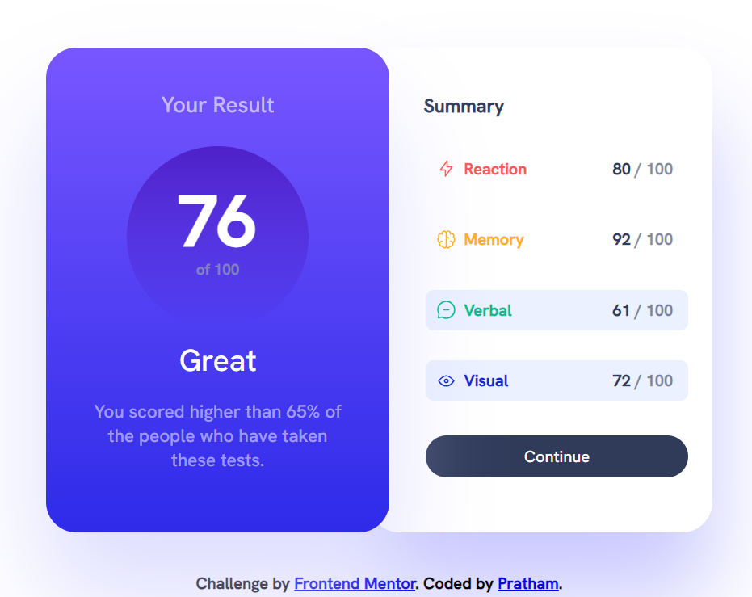
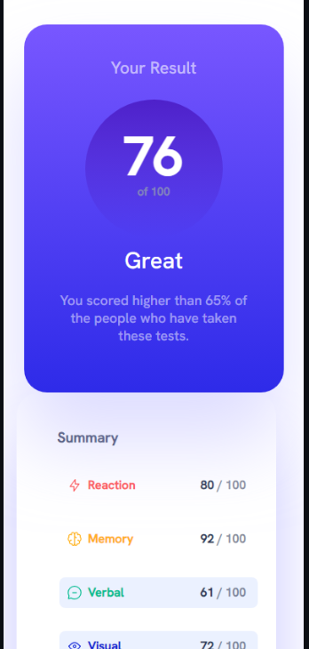
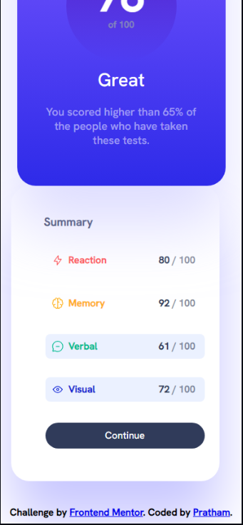

# Frontend Mentor - Results summary component solution

This is a solution to the [Results summary component challenge on Frontend Mentor](https://www.frontendmentor.io/challenges/results-summary-component-CE_K6s0maV). Frontend Mentor challenges help you improve your coding skills by building realistic projects. 

## Table of contents

- [Overview](#overview)
  - [The challenge](#the-challenge)
  - [Screenshot](#screenshot)
  - [Links](#links)
- [My process](#my-process)
  - [Built with](#built-with)
  - [What I learned](#what-i-learned)
  - [Continued development](#continued-development)
- [Author](#author)
## Overview
### The challenge

Users should be able to:

- View the optimal layout for the interface depending on their device's screen size
- See hover and focus states for all interactive elements on the page

### Screenshot

### Links

- Solution URL: [Add solution URL here](https://your-solution-url.com)
- Live Site URL: [Add live site URL here](https://your-live-site-url.com)

## My process

### Built with

- Semantic HTML5 markup
- CSS custom properties
- Flexbox

### What I learned

While doing this challenge I learned about the various properties of CSS styling and how exactly they affect the looks of the components. I did faced the challenge of making the solution responsive for mobile devices but I did my part and made it responsive, it is not as per the expected image though.
It is my first challenge and I hope to look for guidance in web development.

### Continued development

The grid property of css is what I lack understanding in. I realized that this challenge might have been easy using that property. There are many areas in which I need to develop my skills on, and I want to continue focusing of such by doing more challenges and finding the area of development.

## Author

- Website - [Pratham Singh](https://www.your-site.com)
- Frontend Mentor - [@PrathamS1](https://www.frontendmentor.io/profile/PrathamS1)
- Twitter - [@Pratham_S1](https://twitter.com/Pratham_S1)
